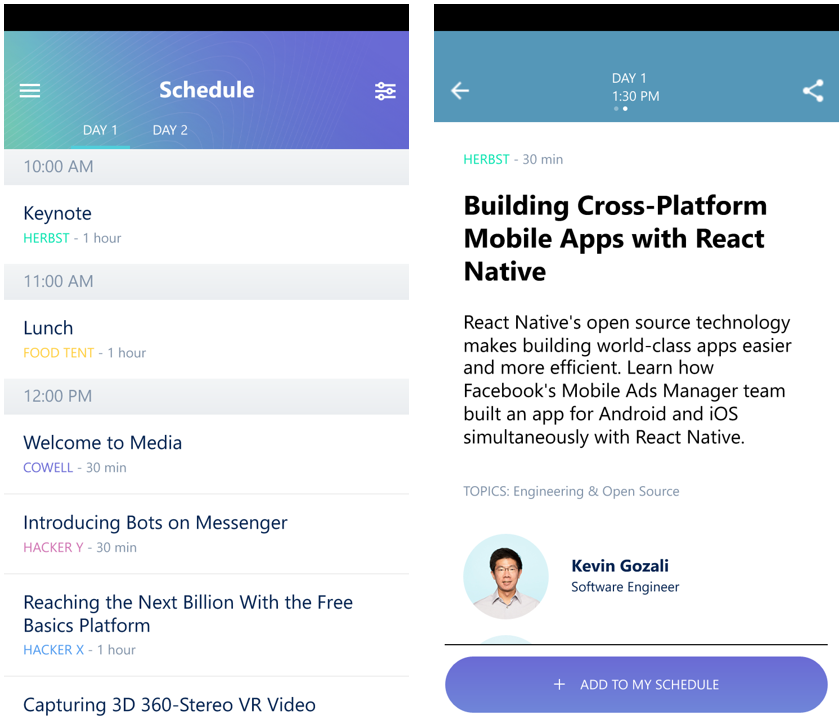

# F8 2016 for the Universal Windows Platform

This is the entire source code of the official [F8](https://fbf8.com/) app of 2016 that appears in the [Windows Store](https://www.microsoft.com/en-us/store/apps/f8-developer-conference/9nblggh4ntvn).  This is several releases behind the current official version, but contains changes required to work on the Universal Windows Platform.



## Requirements

- [Visual Studio 2015](https://msdn.microsoft.com/en-us/library/dd831853.aspx): Community and all other editions supported
- [Windows 10 SDK](https://developer.microsoft.com/en-US/windows/downloads/windows-10-sdk): Download the latests
- [Node.js v5.10.1+](https://nodejs.org/)
- [NPM v3+](https://www.npmjs.com/)
- Git Client - For example:
    - [GitHub Desktop for Windows](https://desktop.github.com/)
    - [Git for Windows](https://git-for-windows.github.io/)
    
## Installation

First, clone the repository to your local machine:
```bash
git clone https://github.com/ReactWindows/f8app.git
cd f8app
git checkout WindowsStore
```

Next, install the NPM dependencies.  Note that this will not work using MSYS such as the Git Bash, so launch a regular command prompt if you do not have Git in your `PATH` environment variable.  This will cause a failure for installing `fsevents` which is not supported on Windows.  If you have Git installed in your `PATH` environment variable and use the command prompt, then it will work properly.

Install the dependencies and then remove the existing `react-native` NPM module.

```bash
npm install
rd /s /q node_modules\react-native
```

After the `react-native` module has been removed, install the ReactWindows version of `react-native`.

```bash
git clone https://github.com/ReactWindows/react-native.git node_modules\react-native
pushd node_modules\react-native
git checkout WindowsStore
popd
```

## Setting Up the Build Environment

- Open up `windows\F8App\F8App.sln` in Visual Studio 2015.
- If this is your first time using UWP, you will have to install the SDK. Right click on the solution file in the solution explorer and select the option labeled "Install Missing Components". You may have to shutdown Visual Studio to continue the installation.
- Build the solution once all the packages are installed Build => Rebuild Solution. 

## Run the F8 App

- Run `react-native start` from the f8app root.
- Set the F8App project as your StartUp Project in Visual Studio.
- Run the app on your targeted device in either Debug or Release configuration.

## Bundle the F8 App

- Run the bundle command
```
react-native bundle --platform windows --dev [true|false] --entry-file index.windows.js --bundle-output windows\F8App\ReactAssets\index.windows.bundle --assets-dest windows\F8App\ReactAssets
```
- Set the F8App project as your StartUp Project in Visual Studio.
- Run the app on your targeted device in either DebugBundle or ReleaseBundle configuration.


